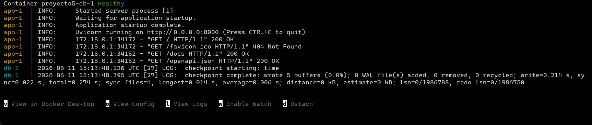
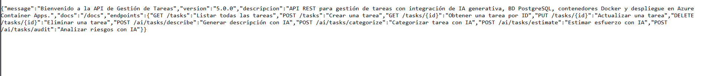
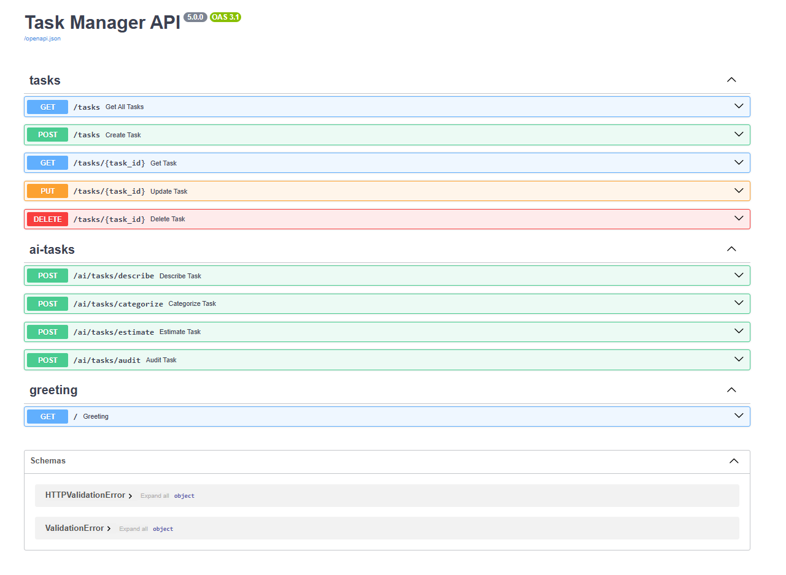
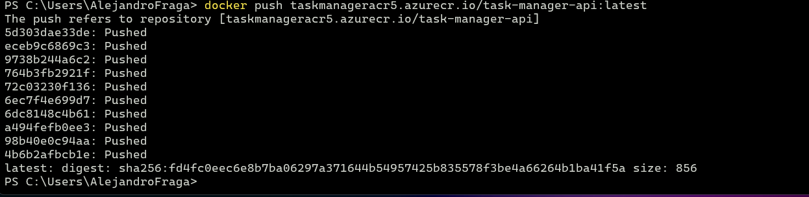
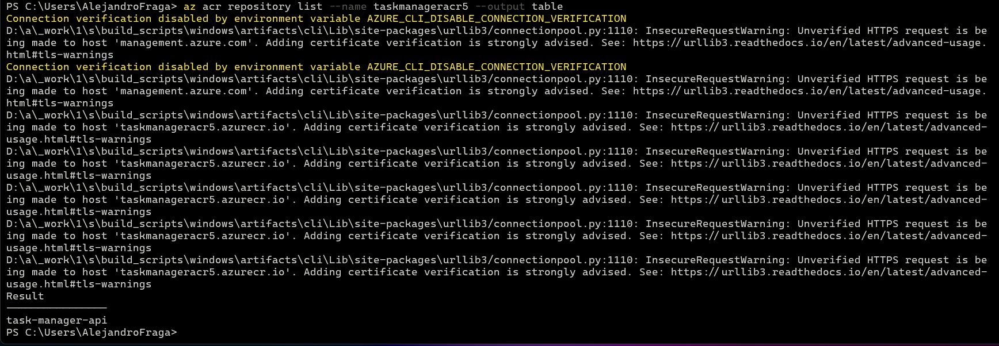
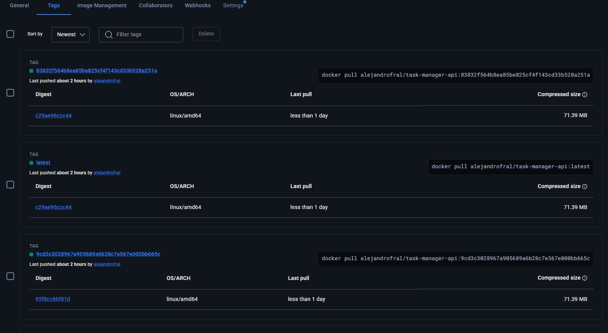
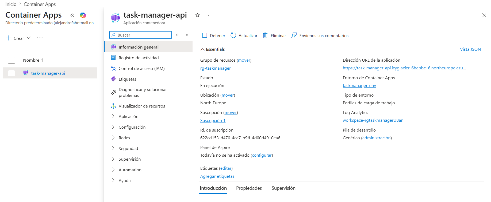
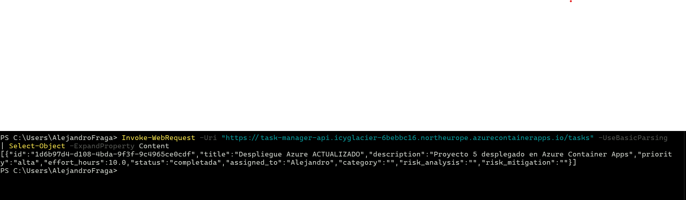
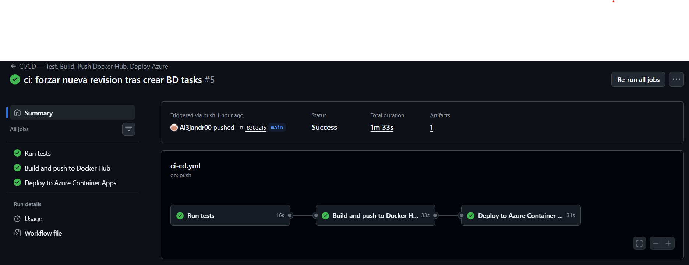
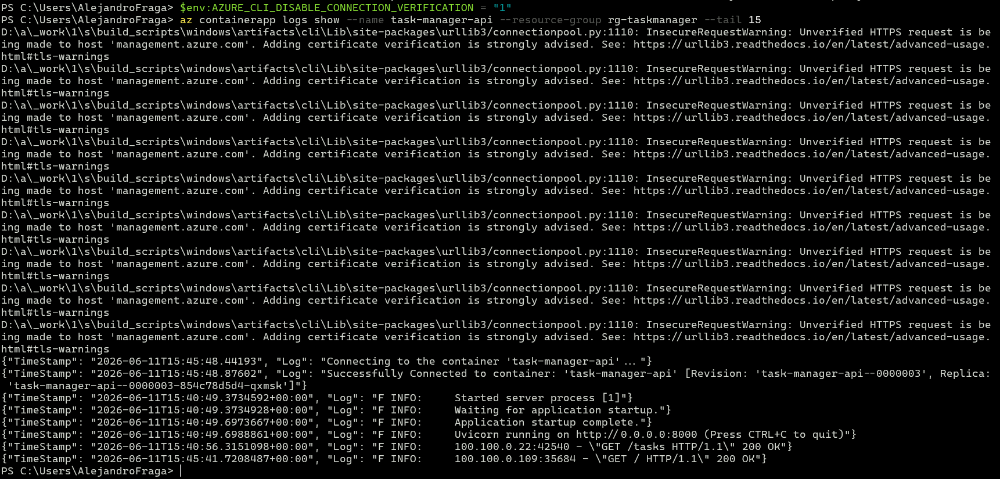

# Memoria Técnica — Entregable 5

## Despliegue en Azure con Docker, CI/CD y Base de Datos

**Asignatura:** Inteligencia Artificial aplicada al Desarrollo de Software  
**Alumno:** Alejandro Fraga  
**Repositorio:** https://github.com/Al3jandr00/UNIR_P5  
**URL de producción:** https://task-manager-api.icyglacier-6bebbc16.northeurope.azurecontainerapps.io

---

## 1. Introducción

Este documento describe el proceso técnico de despliegue en Azure de la API de Gestión de Tareas desarrollada a lo largo de los cuatro entregables anteriores. El objetivo del Entregable 5 es completar el ciclo DevOps completo: contenerización con Docker Compose, publicación de imagen en Azure Container Registry, despliegue en Azure Container Apps con base de datos PostgreSQL gestionada, y automatización del flujo completo mediante un pipeline CI/CD en GitHub Actions.

> **Nota sobre el framework:** El enunciado sugiere Flask (Python) o Express (Node.js). Se ha utilizado **FastAPI** en su lugar por coherencia con los cuatro entregables anteriores, donde se estableció esta elección técnica. FastAPI es un framework Python moderno que cubre el mismo rol de backend HTTP con mayor rendimiento y validación de datos nativa mediante Pydantic.

### Evolución del proyecto

| Entregable | Tecnología añadida |
|------------|-------------------|
| E1 | FastAPI + JSON, arquitectura en 4 capas |
| E2 | Integración con OpenAI (describe, categorize, estimate, audit) |
| E3 | SQLAlchemy + MySQL, persistencia relacional |
| E4 | Dockerfile non-root, pipeline CI/CD básico, Docker Hub |
| **E5** | **docker-compose, ACR, Azure Container Apps, PostgreSQL en Azure, pipeline CI/CD completo** |

---

## 2. Arquitectura del sistema

### 2.1 Arquitectura en producción (Azure)

```
┌─────────────────────────────────────────────────────────┐
│                    GitHub (UNIR_P5)                     │
│  git push main → GitHub Actions (test → build → deploy) │
└─────────────────────┬───────────────────────────────────┘
                      │
       ┌──────▼──────┐  ┌─────────────────────────┐
       │  Docker Hub │  │ ACR (taskmanageracr5)   │
       │  :latest    │  │ task-manager-api:latest │
       │  :<SHA>     │  │ (registro oficial Azure)│
       └──────┬──────┘  └─────────────────────────┘
              │ pull (deploy)
┌─────────────────────▼───────────────────────────────────┐
│              Azure (northeurope)                        │
│                                                         │
│  ┌─────────────────────────────────────────────────┐    │
│  │         Azure Container Apps                    │    │
│  │   task-manager-api  (FastAPI v5.0.0)            │    │
│  │   https://task-manager-api.icyglacier-...       │    │
│  └──────────────────────┬──────────────────────────┘    │
│                         │ PostgreSQL (SSL)              │
│  ┌──────────────────────▼──────────────────────────┐    │
│  │    Azure DB for PostgreSQL Flexible Server      │    │
│  │    taskmanager-db  (Standard_B1ms)              │    │
│  └─────────────────────────────────────────────────┘    │
└─────────────────────────────────────────────────────────┘
```

### 2.2 Arquitectura local (docker-compose)

```
┌────────────────────────────────────────┐
│         docker-compose.yml             │
│                                        │
│  ┌─────────────┐     ┌───────────────┐ │
│  │  app:8000   │ ──> │  db:5432      │ │
│  │  FastAPI    │     │  postgres:16  │ │
│  │  (imagen    │     │  alpine       │ │
│  │   local)    │     │               │ │
│  └─────────────┘     └───────────────┘ │
│       ▲                    │           │
│       │ healthcheck        │ pgdata    │
│       └────────────────────┘ (volumen) │
└────────────────────────────────────────┘
         http://localhost:8000
```

### 2.3 Arquitectura de código (SOLID)

```
Proyecto 5/
├── domain/          ← Entidad Task (sin dependencias externas)
├── application/     ← TaskManager opera contra protocolos
├── infrastructure/  ← SQLAlchemy, Settings, AI providers
│   ├── database.py       engine + SessionLocal + get_db()
│   ├── task_model.py     ORM model (tabla tasks)
│   ├── sql_repository.py implementa TaskRepositoryProtocol
│   └── settings.py       variables de entorno
└── interface/       ← Rutas FastAPI, inyección de dependencias
    ├── routes.py
    ├── ai_routes.py
    └── dependencies.py   get_task_manager → SqlRepository → TaskManager
```

**Principios SOLID aplicados:**
- **S** — `SqlRepository` solo convierte entre dominio y ORM; `TaskManager` solo orquesta lógica de negocio
- **O** — Se sustituyó `JsonRepository` por `SqlRepository` sin modificar `TaskManager`
- **L** — `SqlRepository` es intercambiable con cualquier implementación del protocolo
- **I** — `TaskRepositoryProtocol` expone solo `load()` y `save()`
- **D** — Las rutas dependen del protocolo, no de la implementación concreta

---

## 3. Estructura del repositorio

```
UNIR_P5/
├── .github/
│   └── workflows/
│       └── ci-cd.yml          ← Pipeline de 3 jobs
├── domain/
│   └── task.py
├── application/
│   ├── task_manager.py
│   └── ai_task_service.py
├── infrastructure/
│   ├── protocols.py
│   ├── settings.py
│   ├── database.py
│   ├── task_model.py
│   ├── sql_repository.py
│   └── ai_provider.py
├── interface/
│   ├── routes.py
│   ├── ai_routes.py
│   └── dependencies.py
├── tests/
│   ├── conftest.py
│   ├── test_task.py
│   ├── test_task_manager.py
│   ├── test_ai_task_service.py
│   └── test_routes.py
├── Dockerfile
├── .dockerignore
├── docker-compose.yml
├── requirements.txt
├── main.py
└── .env.example
```

---

## 4. Contenerización con Docker y Docker Compose

### 4.1 Dockerfile

El `Dockerfile` implementa buenas prácticas de seguridad y optimización:

```dockerfile
FROM python:3.12-slim
WORKDIR /app
COPY requirements.txt .
RUN pip install --no-cache-dir -r requirements.txt
COPY . .
RUN addgroup --system appgroup \
    && adduser --system --ingroup appgroup --no-create-home appuser \
    && chown -R appuser:appgroup /app
USER appuser
EXPOSE 8000
CMD ["uvicorn", "main:app", "--host", "0.0.0.0", "--port", "8000"]
```

- **Usuario non-root** (`appuser`): el proceso nunca corre como root, reduciendo la superficie de ataque
- **Capa de dependencias separada**: `COPY requirements.txt` antes que `COPY . .` maximiza el uso de caché de Docker
- **Imagen slim**: `python:3.12-slim` en lugar de la imagen completa reduce el tamaño final

### 4.2 docker-compose.yml

```yaml
services:
  db:
    image: postgres:16-alpine
    environment:
      POSTGRES_DB: tasks
      POSTGRES_USER: postgres
      POSTGRES_PASSWORD: postgres
    volumes:
      - pgdata:/var/lib/postgresql/data
    healthcheck:
      test: ["CMD-SHELL", "pg_isready -U postgres -d tasks"]
      interval: 5s
      timeout: 5s
      retries: 10

  app:
    build: .
    ports:
      - "8000:8000"
    depends_on:
      db:
        condition: service_healthy
    environment:
      DB_HOST: db
      DB_PORT: 5432
      DB_NAME: tasks
      DB_USER: postgres
      DB_PASSWORD: postgres
      DB_SSLMODE: disable

volumes:
  pgdata:
```

**Decisiones de diseño:**
- `postgres:16-alpine`: imagen más ligera que la oficial completa (~100MB vs ~400MB)
- `healthcheck` + `condition: service_healthy`: garantiza que la app no arranca hasta que PostgreSQL esté listo, evitando race conditions
- `DB_SSLMODE: disable`: el PostgreSQL local no tiene SSL; en Azure se usa `require` por defecto
- Volumen `pgdata`: los datos persisten entre reinicios del contenedor

### 4.3 Ejecución local

Comando para levantar el entorno completo:

```bash
docker compose up --build
```








La aplicación queda disponible en `http://localhost:8000` con PostgreSQL corriendo en el contenedor `db` y la API en el contenedor `app`.

---

## 5. Registro de imagen en Azure Container Registry (ACR)

### 5.1 Creación del ACR

Se creó un Azure Container Registry en el mismo resource group que el resto de recursos:

```bash
az acr create \
  --resource-group rg-taskmanager \
  --name taskmanageracr5 \
  --sku Basic \
  --location northeurope
```

El registro quedó disponible en: `taskmanageracr5.azurecr.io`

### 5.2 Publicación de la imagen

Login, etiquetado y push de la imagen al ACR:

```bash
az acr login --name taskmanageracr5

docker tag proyecto5-app:latest taskmanageracr5.azurecr.io/task-manager-api:latest
docker push taskmanageracr5.azurecr.io/task-manager-api:latest
```





### 5.3 Relación entre ACR y el pipeline de despliegue

El pipeline de GitHub Actions publica adicionalmente en **Docker Hub** para el despliegue automático en Azure Container Apps. La imagen en **ACR** (`taskmanageracr5.azurecr.io`) es el registro oficial de Azure donde se almacena la imagen; Docker Hub actúa como fuente de despliegue en el pipeline automatizado por su integración nativa con GitHub Actions. Ambos registros contienen la misma imagen.

```bash
# Tags en Docker Hub (pipeline CI/CD)
al3jandr00/task-manager-api:latest
al3jandr00/task-manager-api:<SHA-commit>

# Tag en ACR (registro oficial Azure)
taskmanageracr5.azurecr.io/task-manager-api:latest
```



---

## 6. Despliegue en Azure

### 6.1 Recursos creados

| Recurso | Nombre | Región | Tier |
|---------|--------|--------|------|
| Resource Group | rg-taskmanager | northeurope | — |
| Container Registry (ACR) | taskmanageracr5 | northeurope | Basic |
| PostgreSQL Flexible Server | taskmanager-db | westeurope | Standard_B1ms (Burstable) |
| Container Apps Environment | taskmanager-env | northeurope | Consumption |
| Container App | task-manager-api | northeurope | — |

### 6.2 Azure Database for PostgreSQL Flexible Server

Se creó un servidor PostgreSQL gestionado en Azure, que delega en Azure la responsabilidad de backups, parches y alta disponibilidad:

```bash
az postgres flexible-server create \
  --resource-group rg-taskmanager \
  --name taskmanager-db \
  --admin-user adminuser \
  --sku-name Standard_B1ms \
  --tier Burstable \
  --public-access 0.0.0.0
```

La base de datos `tasks` se creó explícitamente:

```bash
az postgres flexible-server db create \
  --resource-group rg-taskmanager \
  --server-name taskmanager-db \
  --database-name tasks
```

**Conexión SSL obligatoria:** Azure PostgreSQL requiere `sslmode=require`. La aplicación lo gestiona en `infrastructure/settings.py`:

```python
def _build_db_url() -> str:
    sslmode = os.getenv("DB_SSLMODE", "require")
    return f"postgresql+psycopg2://{user}:{password}@{host}:{port}/{name}?sslmode={sslmode}"
```

### 6.3 Azure Container Apps

Se creó el entorno y la aplicación en `northeurope` (westeurope tuvo problemas de capacidad de AKS durante la creación):

```bash
az containerapp env create \
  --name taskmanager-env \
  --resource-group rg-taskmanager \
  --location northeurope

az containerapp create \
  --name task-manager-api \
  --resource-group rg-taskmanager \
  --environment taskmanager-env \
  --image al3jandr00/task-manager-api:latest \
  --target-port 8000 \
  --ingress external \
  --env-vars DB_HOST=taskmanager-db.postgres.database.azure.com \
             DB_NAME=tasks DB_USER=adminuser \
             DB_PASSWORD=secretref:db-password \
             AI_ALLOW_LOCAL_FALLBACK=true

> La imagen inicial se tomó de Docker Hub. Las actualizaciones posteriores se gestionan automáticamente por el pipeline CI/CD (`az containerapp update --image ...`). La misma imagen está disponible en ACR: `taskmanageracr5.azurecr.io/task-manager-api:latest`.
```

Container Apps proporciona automáticamente:
- Dominio HTTPS con certificado gestionado
- Escalado automático (0 a N réplicas según tráfico)
- Sistema de revisiones (cada despliegue crea una nueva revisión)
- Health checks integrados



### 6.4 Verificación del despliegue

La API responde correctamente en producción:

```json
GET https://task-manager-api.icyglacier-6bebbc16.northeurope.azurecontainerapps.io/

{
  "message": "Bienvenido a la API de Gestión de Tareas",
  "version": "5.0.0",
  "descripcion": "API REST para gestión de tareas con integración de IA generativa, BD PostgreSQL, contenedores Docker y despliegue en Azure Container Apps.",
  "docs": "/docs",
  "endpoints": {
    "GET /tasks": "Listar todas las tareas",
    "POST /tasks": "Crear una tarea",
    ...
  }
}
```

Prueba de persistencia en PostgreSQL de Azure:

```json
POST /tasks
{
  "title": "Despliegue Azure",
  "description": "Proyecto 5 desplegado en Azure Container Apps",
  "priority": "alta",
  "effort_hours": 8,
  "status": "completada",
  "assigned_to": "Alejandro"
}

Response 201:
{
  "id": "1d6b97d4-d108-4bda-9f3f-9c4965ce0cdf",
  "title": "Despliegue Azure",
  ...
}
```



---

## 7. Pipeline CI/CD con GitHub Actions

### 7.1 Diseño del pipeline

```
git push main
     │
     ▼
┌─────────────────────────┐
│ Job 1: test             │
│  • pytest (50 tests)    │
│  • SQLite en memoria    │
└────────────┬────────────┘
             │ OK
             ▼
┌─────────────────────────┐
│ Job 2: docker-build-push│
│  • docker build         │
│  • push :latest + :SHA  │
│  → Docker Hub           │
└────────────┬────────────┘
             │ OK
             ▼
┌─────────────────────────┐
│ Job 3: azure-deploy     │
│  • az login             │
│  • az containerapp      │
│    update --image :SHA  │
└─────────────────────────┘
```

### 7.2 Archivo de workflow

```yaml
name: CI/CD — Test, Build, Push Docker Hub, Deploy Azure

on:
  push:
    branches: [main]
  pull_request:
    branches: [main]

jobs:
  test:
    runs-on: ubuntu-latest
    steps:
      - uses: actions/checkout@v4
      - uses: actions/setup-python@v5
        with: { python-version: "3.12" }
      - run: pip install -r requirements.txt
      - run: pytest tests/ -v
        env:
          DB_URL: "sqlite:///:memory:"
          AI_ALLOW_LOCAL_FALLBACK: "true"

  docker-build-push:
    needs: test
    runs-on: ubuntu-latest
    if: github.ref == 'refs/heads/main' && github.event_name == 'push'
    steps:
      - uses: actions/checkout@v4
      - uses: docker/login-action@v3
        with:
          username: ${{ secrets.DOCKERHUB_USERNAME }}
          password: ${{ secrets.DOCKERHUB_TOKEN }}
      - uses: docker/build-push-action@v6
        with:
          push: true
          tags: |
            ${{ env.IMAGE_NAME }}:latest
            ${{ env.IMAGE_NAME }}:${{ github.sha }}

  azure-deploy:
    needs: docker-build-push
    runs-on: ubuntu-latest
    steps:
      - uses: azure/login@v2
        with: { creds: ${{ secrets.AZURE_CREDENTIALS }} }
      - run: |
          az containerapp update \
            --name task-manager-api \
            --resource-group rg-taskmanager \
            --image ${{ env.IMAGE_NAME }}:${{ github.sha }}
```

### 7.3 Secretos configurados en GitHub

| Secreto | Descripción |
|---------|-------------|
| `DOCKERHUB_USERNAME` | Usuario de Docker Hub |
| `DOCKERHUB_TOKEN` | Token de acceso de Docker Hub |
| `AZURE_CREDENTIALS` | JSON del service principal de Azure |

El service principal fue creado con permisos mínimos sobre el resource group:

```bash
az ad sp create-for-rbac \
  --name sp-taskmanager-deploy \
  --role Contributor \
  --scopes /subscriptions/<id>/resourceGroups/rg-taskmanager
```



---

## 8. Monitoreo y validación

### 8.1 Logs en tiempo real

Azure Container Apps permite consultar los logs directamente desde CLI:

```bash
az containerapp logs show \
  --name task-manager-api \
  --resource-group rg-taskmanager \
  --tail 20
```

Extracto de logs en producción:

```
INFO:     Application startup complete.
INFO:     Uvicorn running on http://0.0.0.0:8000
INFO:     100.100.0.109:33638 - "GET / HTTP/1.1" 200 OK
INFO:     100.100.0.109:32912 - "GET /tasks HTTP/1.1" 200 OK
```



### 8.2 Sistema de revisiones

Cada despliegue crea una nueva revisión inmutable. El sistema mantiene el historial completo:

```
task-manager-api--0000001  Unhealthy  (error SSL inicial)
task-manager-api--0000002  Failed     (BD no existía)
task-manager-api--0000003  Active ✓   100% tráfico
```

Esto permite rollback instantáneo a cualquier revisión anterior si se detecta un problema.

### 8.3 Pruebas de integración end-to-end

**Prueba de escritura (POST /tasks):**
```bash
curl -X POST https://task-manager-api.icyglacier-6bebbc16.northeurope.azurecontainerapps.io/tasks \
  -H "Content-Type: application/json" \
  -d '{"title":"Despliegue Azure","priority":"alta","effort_hours":8,"status":"completada"}'

# Response 201
{"id":"1d6b97d4-d108-4bda-9f3f-9c4965ce0cdf","title":"Despliegue Azure",...}
```

**Prueba de lectura y persistencia (GET /tasks):**
```bash
curl https://task-manager-api.icyglacier-6bebbc16.northeurope.azurecontainerapps.io/tasks

# Response 200 — tarea persiste en PostgreSQL de Azure
[{"id":"1d6b97d4-d108-4bda-9f3f-9c4965ce0cdf","title":"Despliegue Azure",...}]
```

---

## 9. Decisiones técnicas

| Decisión | Alternativa descartada | Motivo |
|----------|------------------------|--------|
| ACR como registro oficial + Docker Hub para pipeline | Solo ACR en todo el flujo | ACR está integrado como registro de Azure; Docker Hub se mantiene en el pipeline CI/CD por su integración nativa con GitHub Actions |
| Azure Container Apps | Azure Container Instances | Container Apps gestiona HTTPS, revisiones y escalado automáticamente |
| Azure DB for PostgreSQL | Contenedor Postgres en Azure | PaaS gestionado: backups, parches y alta disponibilidad incluidos |
| SQLAlchemy síncrono | asyncpg + SQLAlchemy async | Simplicidad; async requeriría reescribir todos los endpoints |
| SQLite en memoria para tests | Postgres en CI | Tests rápidos sin dependencias externas; SQLAlchemy abstrae el dialecto |
| `Base.metadata.create_all` | Alembic migrations | Simplicidad para el entregable; Alembic es la opción para producción real |
| `DB_SSLMODE` configurable | `sslmode` hardcodeado | Local necesita `disable`, Azure necesita `require`; misma imagen para ambos entornos |
| northeurope | westeurope | westeurope tenía problemas de capacidad de AKS al crear el entorno de Container Apps |

---

## 10. Tests

Se mantienen los 50 tests del Entregable 4, adaptados para usar SQLite en memoria:

```python
# tests/conftest.py
engine = create_engine(
    "sqlite:///:memory:",
    connect_args={"check_same_thread": False},
    poolclass=StaticPool,  # misma conexión en todos los threads
)
```

`StaticPool` fue necesario porque SQLite en memoria crea bases de datos separadas por conexión; con `StaticPool` todos los accesos usan la misma conexión y ven la misma BD.

```
pytest tests/ -v

50 passed in 2.31s
```

---

## 11. Conclusiones

El Entregable 5 completa el ciclo DevOps de la API de Gestión de Tareas:

- **Contenerización completa**: Dockerfile non-root + docker-compose con PostgreSQL, healthchecks y volumen persistente
- **Registro en Azure (ACR)**: imagen publicada en `taskmanageracr5.azurecr.io` como registro oficial de Azure
- **Despliegue cloud**: Azure Container Apps con HTTPS automático, escalado y sistema de revisiones
- **Base de datos gestionada**: Azure Database for PostgreSQL Flexible Server con SSL obligatorio
- **CI/CD automatizado**: 3 jobs (test → build/push → deploy) que garantizan que solo código probado llega a producción
- **Principios SOLID**: la sustitución de `JsonRepository` por `SqlRepository` se realizó sin modificar ninguna capa superior, validando la arquitectura de 4 capas y el patrón de inyección de dependencias

La misma imagen Docker se ejecuta localmente (con `docker-compose`) y en Azure (Container Apps), garantizando la paridad entre entornos de desarrollo y producción.
